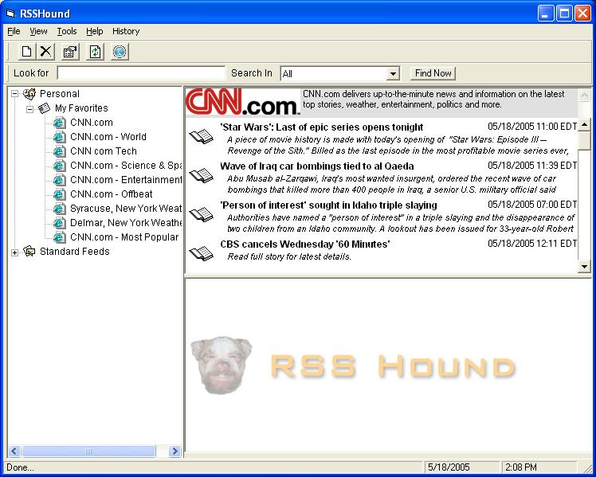



## RSSHound 1\.5

### Description

This is a RSS, XML, and ATOM news reader written in VB6.0 that utilizes a MsAccess 2000 db to manage subsriptions and viewed documents.

Many popup menus included with this version as well as an internalized usercontrol for displaying the news feeds.

No special Dll's or OCX's are needed. Just the standard microsoft components
 
### More Info
 

             |
---                |---
**Submitted On**   |2005-05-18 14:03:32
**By**             |[Benjamin Bibik](https://github.com/Planet-Source-Code/PSCIndex/blob/master/ByAuthor/benjamin-bibik.md)
**Level**          |Advanced
**User Rating**    |4.5 (18 globes from 4 users)
**Compatibility**  |VB 6\.0
**Category**       |[Complete Applications](https://github.com/Planet-Source-Code/PSCIndex/blob/master/ByCategory/complete-applications__1-27.md)
**World**          |[Visual Basic](https://github.com/Planet-Source-Code/PSCIndex/blob/master/ByWorld/visual-basic.md)
**Archive File**   |[RSSHound\_11889515182005\.zip](https://github.com/Planet-Source-Code/benjamin-bibik-rsshound-1-5__1-60582/archive/master.zip)

